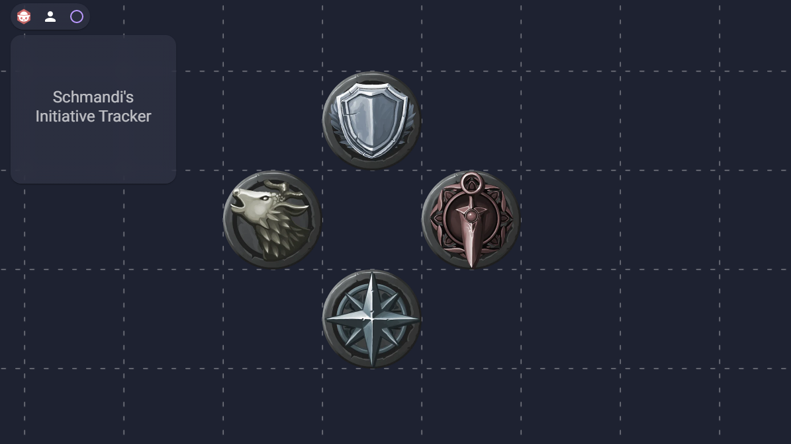
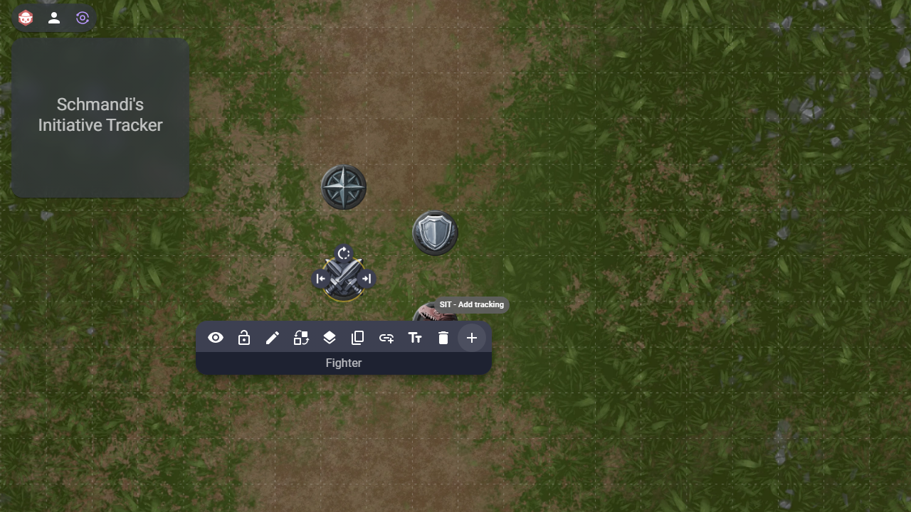
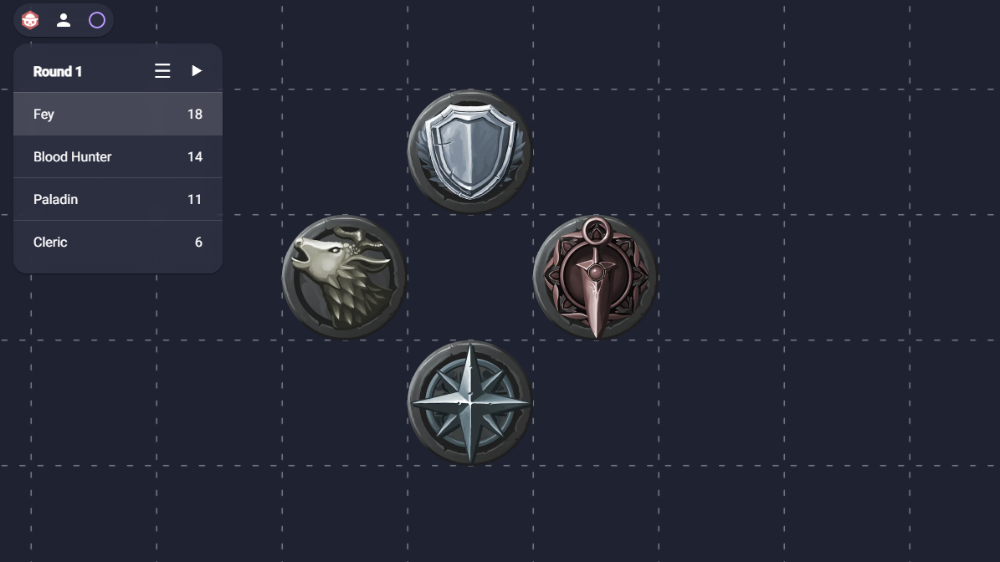
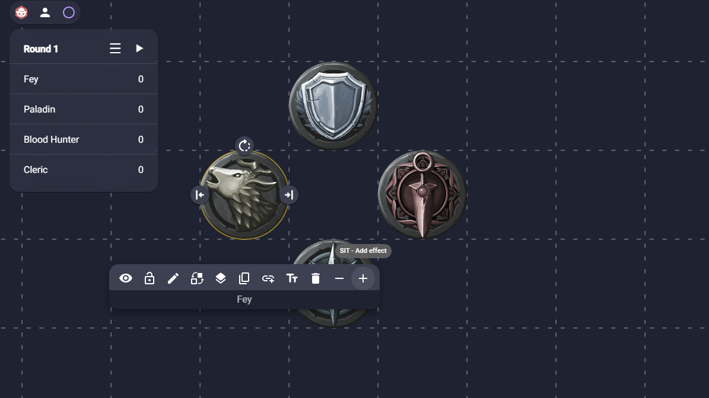
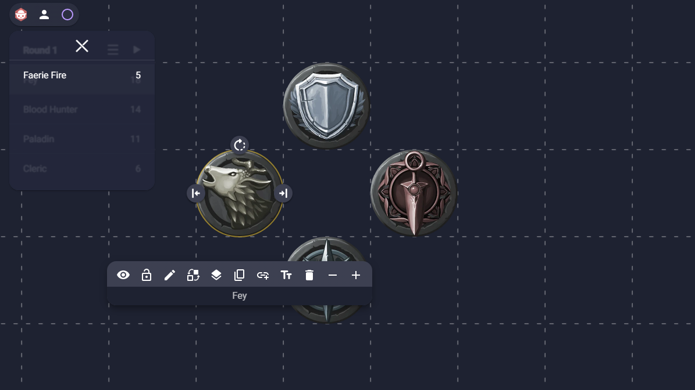
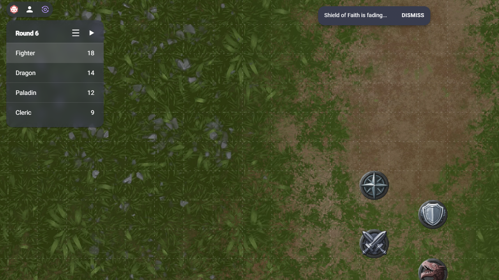

# Schmandi's Initiative Tracker

A basic Initiative and Effects Tracker extension for [owlbear.rodeo](https://www.owlbear.rodeo/)

## Features

Add tokens to the initiative list!

Manage the characters initiative and the current battle round!

Add a characters effect and manage their duration!

Get notified when effects fade away!

## Install SIT

- Go to your [owlbear.rodeo profile](https://www.owlbear.rodeo/profile) and scroll down to "Extensions".
- Click "Add Extension".
- Copy and paste following install link:
  - https://sit.manuelpoell.at/assets/manifest.json
- Have fun!
